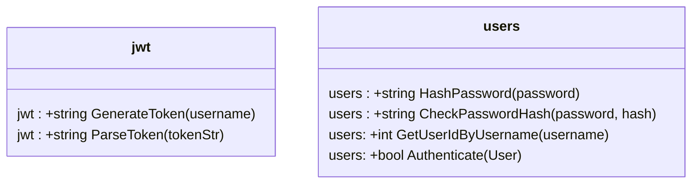
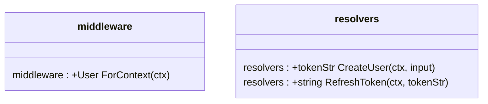
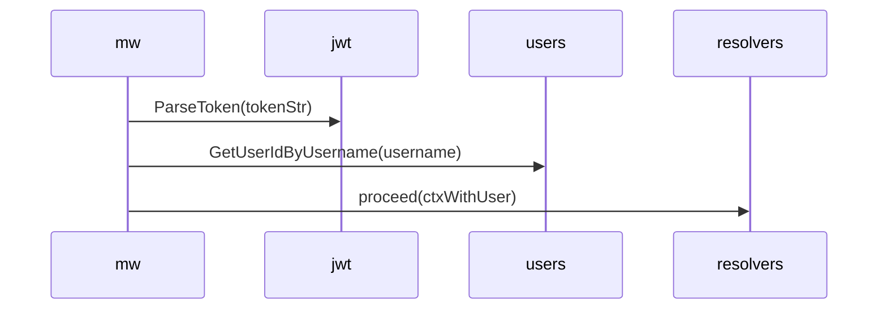
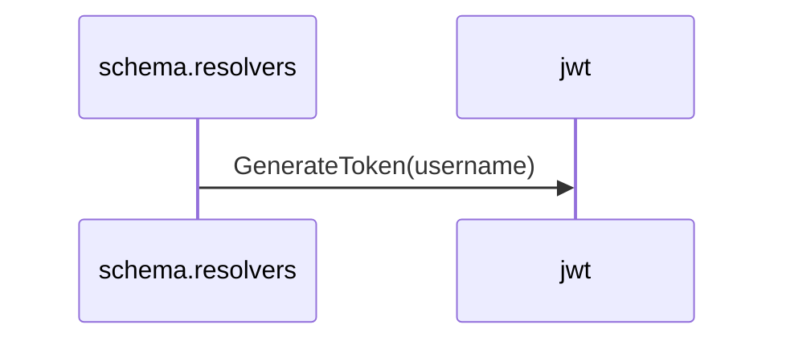
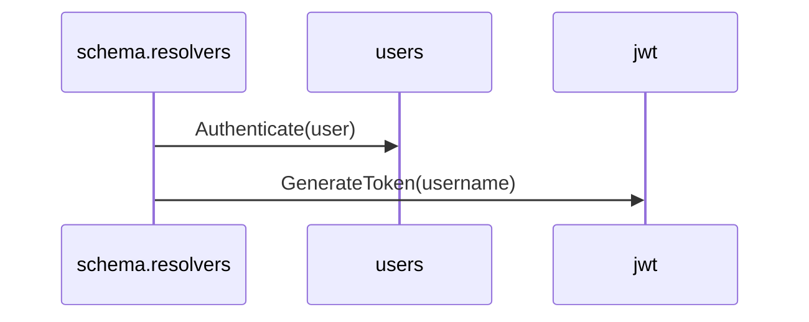

# hackernews
A project to learn integration of go with gqlgen

A Hackernews clone with Go, GraphQL and JWT. 

The API should be able to handle registration, authentication, submitting links and getting list of links.

## Instructions

1. In MySQL db
```
CREATE DATABASE hackernews;
```

2. Cli
```
git clone https://github.com/ellieasager/hackernewsJwt
cd hackernewsJwt
printf '// +build tools\npackage tools\nimport _ "github.com/99designs/gqlgen"' | gofmt > tools.go
go mod tidy
```

3. In code:
In the file `internal/pkg/db/mysql/mysql.go` set username and password for the db connection in method `InitDB()`.

4. Cli: make sure to use your username and password when running the command below
```
migrate -database mysql://root:dbpassword@/hackernews -path internal/pkg/db/migrations/mysql up
```

5. Cli: `go run server.go`

6. In your browser go to http://localhost:8080/

- Try creating a user:
```
mutation {
  createUser(input: {username: "new user", password: "password"}){
    id,
    name
  }
}
```

- List existing users:
```
query {
  users {
    id
    name
  }
}
```

7. If you need to re-generate files, run 
```
go run github.com/99designs/gqlgen generate
```


## Key Components




## Authorization in `middleware.go`

This code in `middleware.go` is executed every time before the request reaches the resolver. If Authz header is missing in request, the request is forwarded to resolver w/o any checks.



**Note**: Authorization code only confirms that user exists in out DB and adds the username/userId data to the context object. A tokenString is parsed and verified, not user password.


## Creating a user
When a new user input is received `schema.resolvers.go` generates a token for that username.




## Login/Authentication
After `middleware.go` extracts username from Authz header (if present), looks up userId by its username, it adds the user Obj to the context and passes it to `schema.resolvers.go`.



**Note**: Authentication code confirms that user exists in DB, their password is correct and gives them a new tokenString.