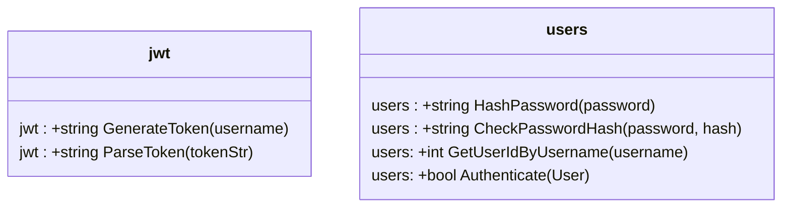
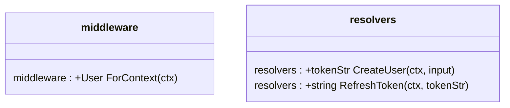
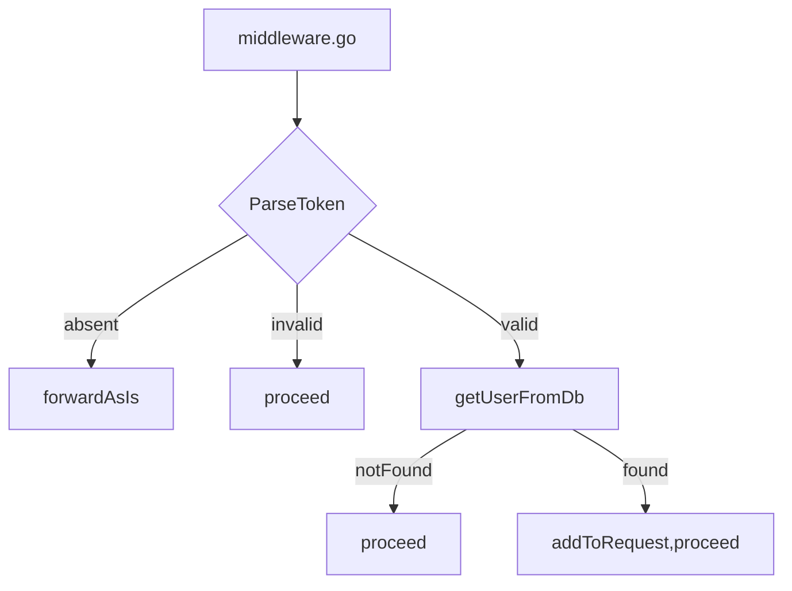
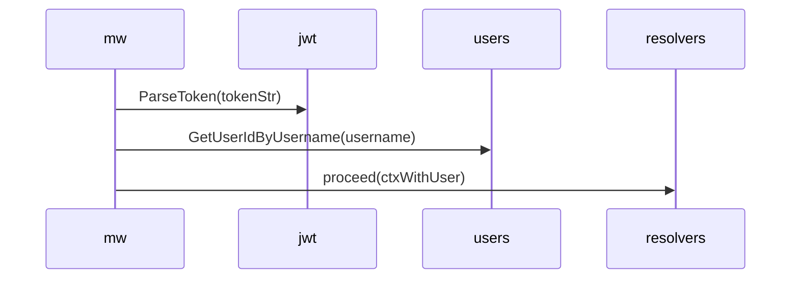
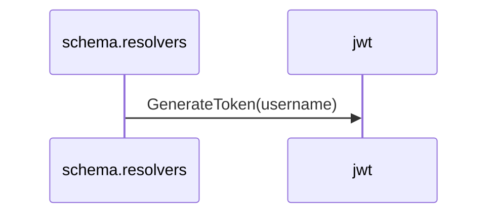
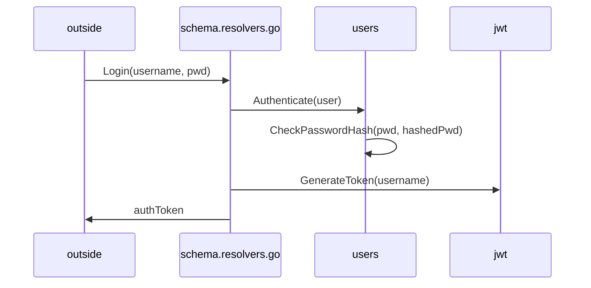

# Key Components




# Authorization in `middleware.go`

This code in `middleware.go` is executed every time before the request reaches the resolver. If Authz header is missing in request, the request is forwarded to resolver w/o any checks.






**Note**: Authorization code only confirms that authToken is valid. If corresponding user exists in DB, it is added to the request's context. User password is not part of authorization.


# Creating an auth token

An auth token is created when an existing user logs in or when a new user is created.

## Creating a new user

When a new user input is received, `schema.resolvers.go` generates a token for that username.



There is no code in this project that does anything with that token. The token is simply returned to user and the user is expected to add this auth header to subsequent requests:
```
{
  "Authorization": "" // the auth token you have received
}
```
See more about it in `GraphQLTests.md`


## Login/Authentication

After `middleware.go` extracts username from Authz header, it looks up userId by its username, adds the `User` object to the request's context and passes it to `schema.resolvers.go`.

`schema.resolvers.go` calls `users.Authenticate(user)` method that, in turn, checks the provided password with the hashed password from db. 

- If the check succeeds, `schema.resolvers.go` calls `jwt.GenerateToken(username)` to return a new auth token. (See diagram below).

- If the check fails, `WrongUsernameOrPasswordError` is returned.



**Note**: Authentication code confirms that user exists in DB, their password is correct and gives them a new authToken.

