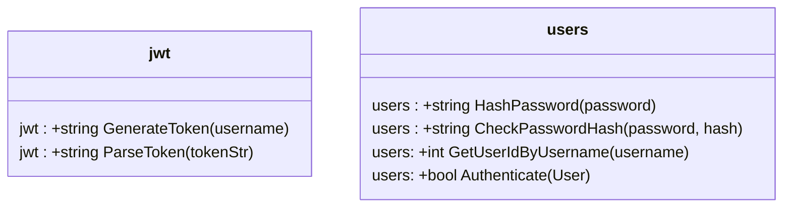
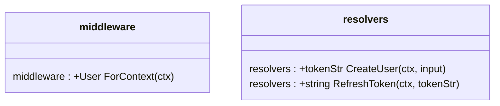
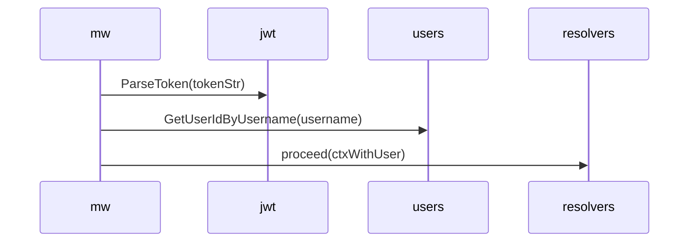
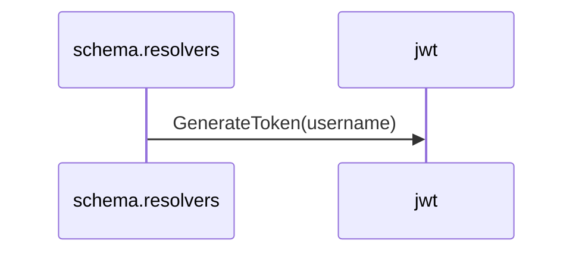
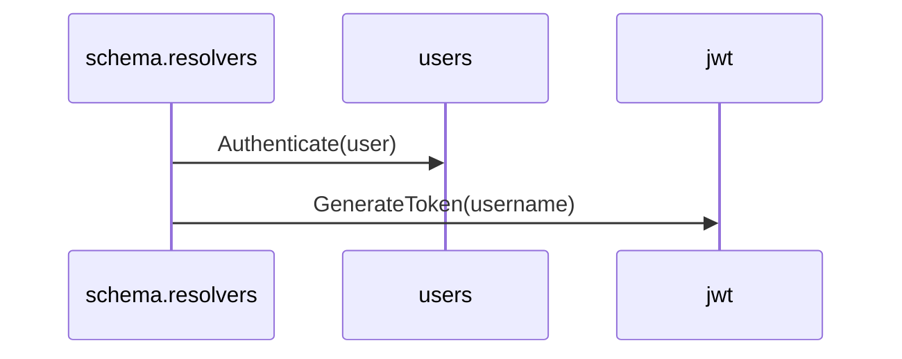

# Key Components

# Authorization in `middleware.go`

This code in `middleware.go` is executed every time before the request reaches the resolver. If Authz header is missing in request, the request is forwarded to resolver w/o any checks.

**Note**: Authorization code only confirms that user exists in out DB and adds the username/userId data to the context object. A tokenString is parsed and verified, not user password.

## Creating a user
When a new user input is received `schema.resolvers.go` generates a token for that username.

## Login/Authentication
After `middleware.go` extracts username from Authz header (if present), looks up userId by its username, it adds the user Obj to the context and passes it to `schema.resolvers.go`.

**Note**: Authentication code confirms that user exists in DB, their password is correct and gives them a new tokenString.

